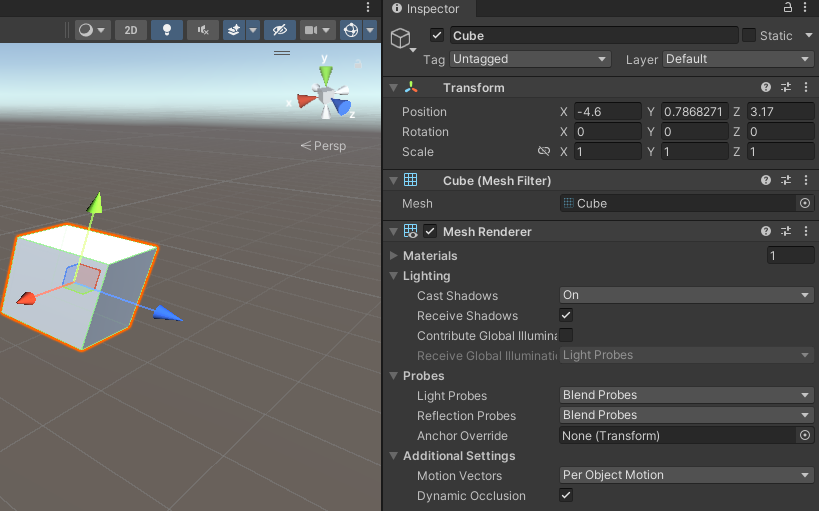
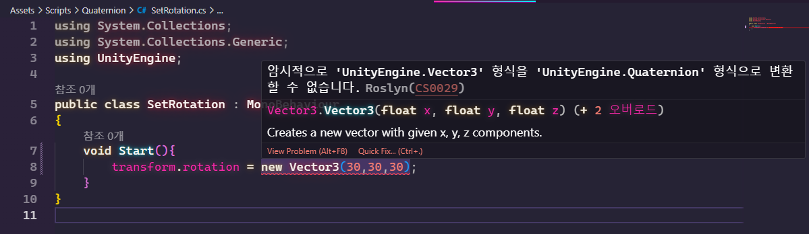
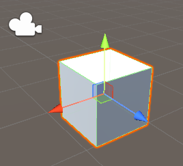
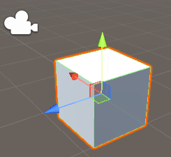

# (Unity) 회전과 쿼터니언



유니티에서는 Inspector창에서 Rotation값을 수정하면서 각각의 축에서 회전하게 만들 수 있다

x, y, z를 통해서 로테이션을 지정하기때문에 겉으로 보기에는 `Vector3`를 사용하여 로테이션을 지정한 것 처럼 보인다

하지만 실제로는 `Quaternion`을 통해서 로테이션이 지정된다, 유니티에서는 쿼터니언이 복잡하기때문에 Vector3로 쿼터니언을 지정하게 해놨다


```cs
public class SetRotation : MonoBehaviour{
    void Start(){
        transform.rotation = new Vector3(30,30,30);
    }
}
```
실제 코드상에서도 `Vector3`를 사용하여 회전을 지정해주면 에러가 나오게 되는데.
그 이유는 rotation은 Vector3로 알고있지만 사실은 아니고 Quaternion이라고 되어있다



# (?) 왜 Vector3로는 안되고 Quaternion을 사용해야할까?
Vector3를 쿼터니언으로서 rotation에 넣어보겠다

유니티에서는 Vector3를 Quaternion으로서 바꿔서 넣도록 만드는 편의 기능이 있다. 

아래 코드처럼 Quaternion 클래스의 `Euler함수`를 사용하여 Vector3를 넣어주면 자동으로 함수 내부에서 Quaternion이라는 데이터 타입으로 바꿔준다
```cs
public class SetRotation : MonoBehaviour{
    void Start(){
        transform.rotation = Quaternion.Euler(new Vector3(30,30,30));
    }
}
```
Euler는 x, y, z Vector3를 통해서 공간의 회전을 표시할 수 있도록 체계를 만든 수학자 이름이다.
x, y, z를 통해서 물체의 회전을 표시할 수 있는 체계(세 개의 각도)를 오일러 각이라고 하는데




이 큐브처럼 처음에 회전각도에서 y축으로 90도 회전을하게 되면 오른쪽큐브처럼 회전을하게되는데 물체가 회전을 하지만 좌표축도 같이 회전하는걸 볼 수 있다.

물체가 이동하면 물체가 가지고있는 좌표계 자체도 이동하는거 자체는 문제가 없었지만 오일러각을 사용한 체계에서는 근본적인 문제가 하나 있게 된다.

위에 큐브처럼 회전했을때 x, z축 같이 만약 겹치는 축이 있게 되어버린다면 그축의 정보가 소실된다.

결국 회전한 후에 z축에 대한 정보가 소실되는데 이러한 현상을 [짐벌락](https://handhp1.tistory.com/3) 현상이라고 한다

어느 방향으로든 90를 회전하면 어느축가 겹치게되어 3차원의 정보를 가져야할 큐브가 2차원의 정보만 남게된다

오일러각에서는 x, y, z 회전을 표현할때 한번에 회전하는게 아닌 사 x->y->z 순서로 회전을 한다
그래서 어떤 축이 회전해서 다른 축과 겹치면 그 두축이 구분이 안가서 다음 축이 어떤걸 기준으로 회전할지 모르기때문에 문제점이 생기게된다.
이런 현상을 방지하고자 Quaternion을 사용한다

# Quaternion을 어떻게 사용할까
`Quaternion`은 오일러각과 다르게 `Vector3`가 아니라 x,y,z,w인 4차원을 사용하여 짐벌락 현상을 방지한다

유니티에서는 쿼터니언 내부를 직접 조작할 수 없도록 막아놨는데, 복잡한 수를 기반으로하고 직관적으로 이해하기 어려울만큼 어렵기때문이다. 그래서 Vector3를 통해서 Quaternion을 조작하도록 해놨고
Quaternion을 직접 조작할 필요가 없다

아래 코드처럼 Quaternion타입의 변수에 Vector3에 회전각도를 지정하고 `Quaternion.Euler` 함수를 사용하여 변환시켜주면된다
```cs
void Start(){
    //회전을 나타내는 데이터타입
    Quaternion newRotation = Quaternion.Euler(new Vector3(45,60,90));
    transform.rotation = newRotation;
}
```

Quaternion에는 유용한 함수들이 더 많은데 아래와 같이 사용하능하다

* `Quaternion.LookRotation`
```cs
public class SetRotation : MonoBehaviour{
    public Transform targetTransform;
    void Start(){
        //상대방위 위치에서 내 위치를 빼주면 내 위치에서 상대방까지의 방향이 나온다
        Vector3 direction = targetTransform.position - transform.position;

        //방향을 넣어주면 해당 방향으로 바라보도록 회전이 지정된다
        Quaternion targetRotaion = Quaternion.LookRotation(direction);
        transform.rotation = targetRotaion;
    }
}
```

* `Quaternion.Lerp` (매개변수로 위치 값 2개를 받고, %값을 받는다)
```cs
void Start(){
    Quaternion aRotation = Quaternion.Euler(new Vector3(30,0,0));
    Quaternion bRotation = Quaternion.Euler(new Vector3(60,0,0));
        
    //a시작지점과 b도착지점, a b사이에 50%인 절반위치가 들어오게 된다 = 45도
    Quaternion targetRotaion = Quaternion.Lerp(aRotation,bRotation,0.5f);
    transform.rotation = targetRotaion;
}
```

* `Quaternion.eulerAngles` (쿼터니언을 Vector3로 변환해준다)
```cs
void Start(){
    //정해진 회전각도가 있는 물체를 30도 더 회전시키는방법

    //1.transform에 내장 기능사용
    transform.Rotate(new Vector3(30,0,0));

    //2.사용하려는 vector3각도를 가져와서 vector3끼리 더한다음 최종적으로 Quaternion을 거치는 방법
    Quaternion originRotation = transform.rotation;//원래 rotation을 Quaternion으로 가져온다
    Vector3 originRotationInVector3 = originRotation.eulerAngles;//Quaternion을 Vector3로서 변환해준다
        
    Vector3 targetRotationVector3 = originRotationInVector3 + new Vector3(30,0,0);
    //뽑은 Vector3를 30도를 더해서 다시 Vector3로 저장한다
    Quaternion targetRotation = Quaternion.Euler(targetRotationVector3);
    //Vector3끼리 더한걸 마지막에 Quaternion으로 넣어주면된다

    transform.rotation = targetRotation;
}
```
### Vector3를 거치지않고 Quaternion끼리 바로 각도를 증가시킬 수 있다
```cs
void Start(){
    Quaternion originRotation = Quaternion.Euler(new Vector3(45,0,0));
    Quaternion plusRotation = Quaternion.Euler(new Vector3(30,0,0));

    //두 쿼터니언끼리 곱하면 값이 더해진다
    Quaternion targetRotation = originRotation * plusRotation;
    transform.rotation = targetRotation;//75도
}
```
# 주의할점
오브젝트를 회전시킬때 값이 가끔 의도와 다르게 나올 때가 있다

그건 코드가 이상하게 동작하는게아닌 회전을 할 때는 언제나 게임세상이 아니라 나 자신을 기준으로 회전하기 때문이라 인지할것
