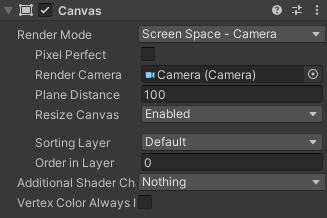
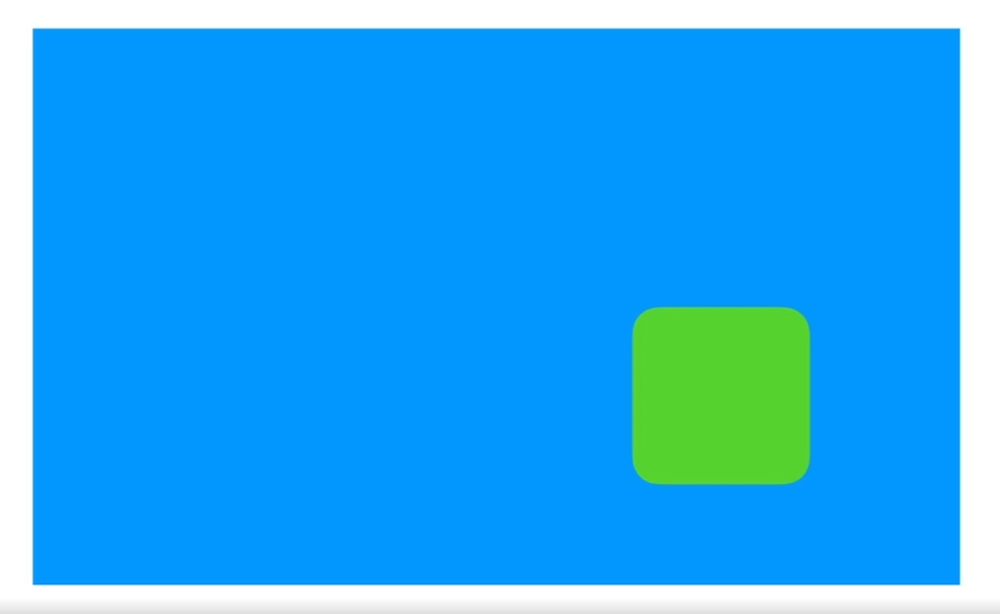
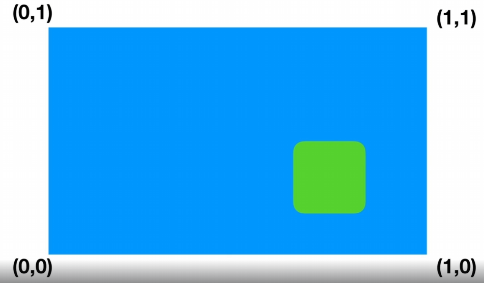
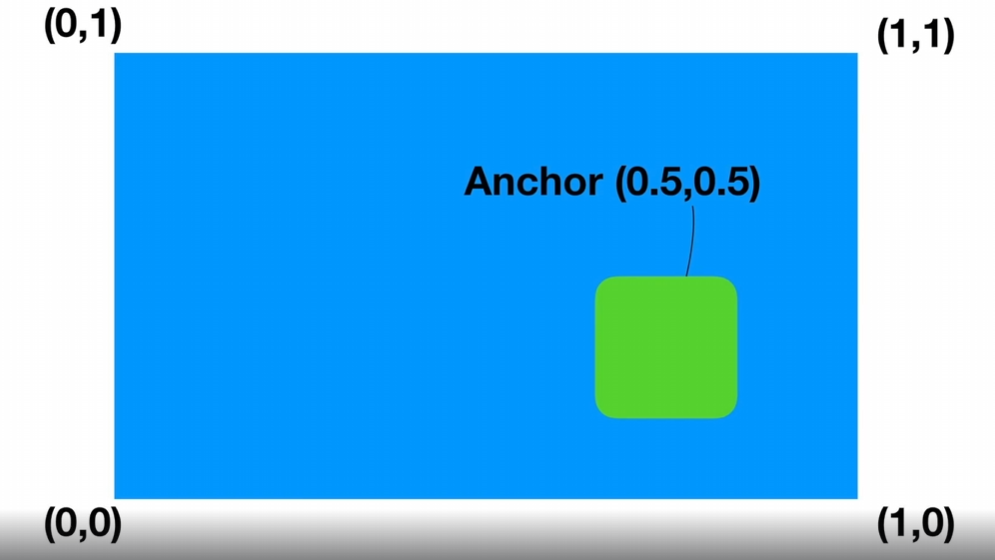
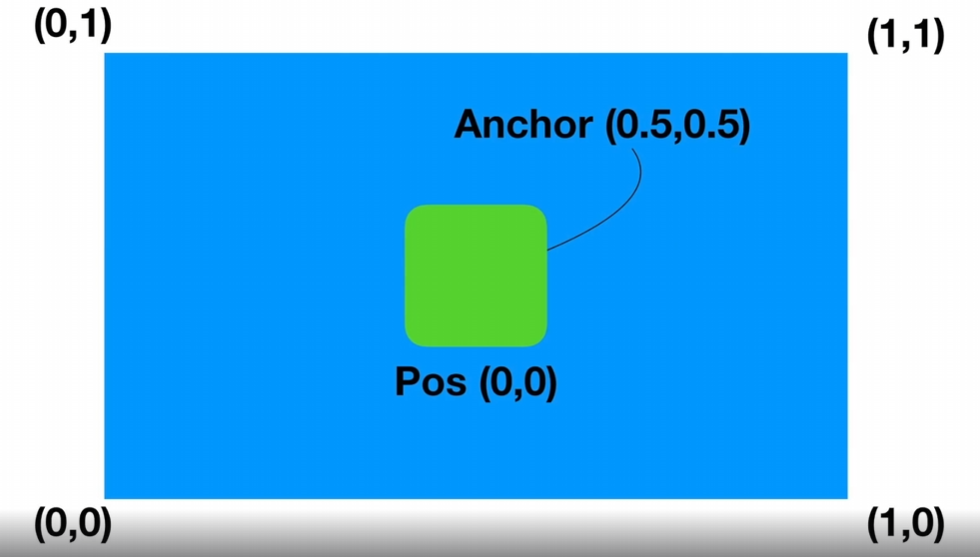
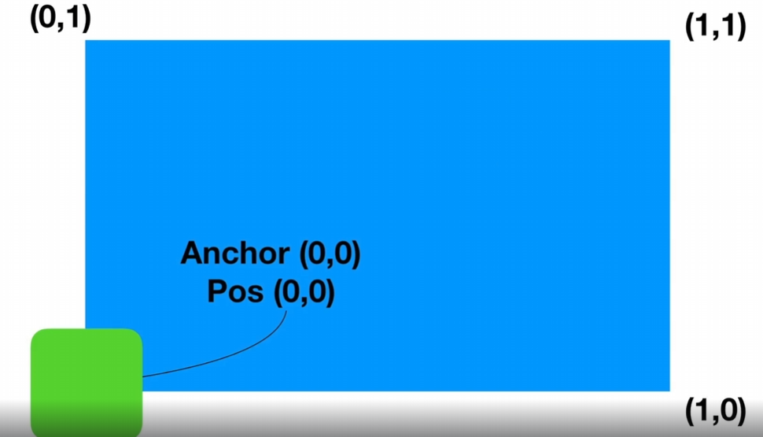
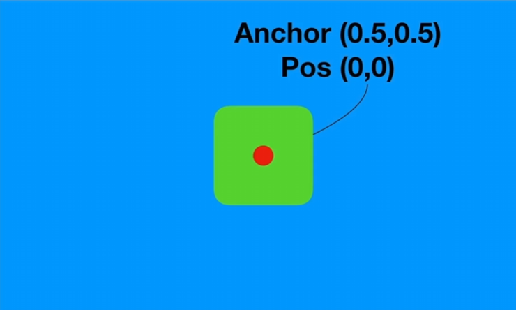
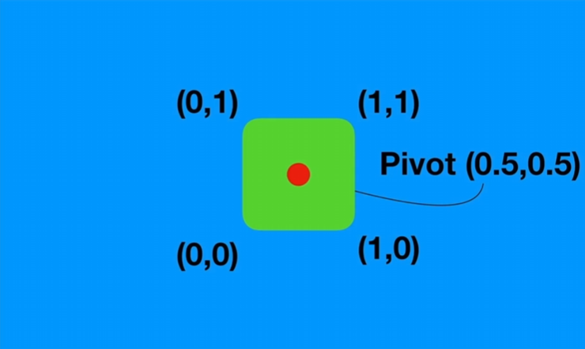
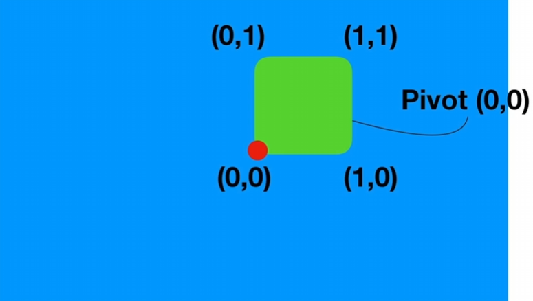

# (Unity) UGUI

UGUI는 유티니의 공식 UI 시스템이다. 이 시스템이 존재하기전까지는 Legacy UI가 존재해서 업데이트문 안에서 매 프레임마다 UI를
새로 그리고 지우고를 코드를 통해서 제어를 했다.

> 코드를 통해서 제어를 했기에 플레이 버튼을 눌러서 테스하기 전까지 UI를 확인할 방법이없었다.

그래서 새로나온 UI시스템은 UI요소를 게임 오브젝트나 컴포넌트로서 편집하게 해준다.  
플레이어에게 RigidBody를 붙이듯이 UI시스템을 게임 오브젝트 Hierarchy 인스펙에서 편집이 가능하기때문에  
UI시스템을 마치 기존에 게임오브젝트를 편집하듯이 쉽게 편집할 수 있다

# (UGUI) 캔버스 
캔버스는 모든 UI 게임 오브젝트들이 들어가 있어야 하는 게임 오브젝트이다  
UI게임 오브젝트들에게 좌표계를 제공하기때문에 모든 UI 게임 오브젝트들은 캔버스 자식으로 있어야한다 

기본적으로 UI 이미지 오브젝트를 만들면 캔버스와 이미지 EventSystem이 생성되고  자동으로 캔버스가 같이 생긴다.  
`EventSystem`은 게임 오브젝트 중에서도 UI게임 오브젝트들이 터치나 클릭 혹은  
개발자가 직접만든 이벤트를 감지할 수 있도록 만들어주는 오브젝트이고 자동으로 동작한다  

`Canvas`는 모든 UI 오브젝들을 가지고있는 스크린과 같은 오브젝트다

유니티 씬 패널에서 2D를 체크하고 캔버스를 더블클릭하면 캔버스를 전체화면으로 볼 수 있는데  
캔버스가 크게 보이는 이유는 3D게임 세상의 좌표계가 아닌 유저의 게임 화면(해상도)에 1:1로 대응하고 동시에 기본 값으로는 Canvas의 1px길이는 유니티 세상의 1m에 대응하기 때문이다
그리고 캔버스는 모든 UI 게임 오브젝트를 위한 스크린 좌표를 제공해주는데 캔버스 자체가 UI 오브젝트들이 배치되기 위한 하나의 프레임을 마련해주는샘이다

그리고 캔버스는 3가지의 Render 모드를 가지는데
* Screen Space - Overlay  
  UI요소들이 스크린 상에만 존재하고 모든 3D오브젝트들이 그려진 다음에 마지막으로 UI요소를 덮어쓰는 방식이다

* Screen Space - Camera  
  이 방식도 위와 마찬가지로 스크린 좌표계에 대응한다. 두 방식다 화면상에 대응을 하지만 이 방식같은 경우는
  Space Camera같은 경우는 3D좌표상에서 위치를 가지게 된다 

인스펙터창에는 초기에는 이런 상태이지만 특정 카메라를 지정하게 되면 

Render Camera에 지정을 해주면 Plane Distance가 생기게되는데  
Plane Distance는 메인 카메라로부터 100m 떨어진 거리에 UI요소가 배치되게 한다

씬에서 2D 모드를 해제하고 캔버스를 보면 이제 좌표를 가지게된다.  
캔버스는 원래 좌표계랑 상관없이 동작하는데 이 방식을 사용하면 카메라를 기준으로 Plane Distance 거리만큼 떨어진곳에 배치가 된다.  
카메라가 이동하거나 회전하게되면 똑같이 캔버스도 따라 움직이는데 보이는 화면은 위에 방식이랑 다를게 없다  

하지만 대상이 되는 카메라에서 평행하게 떨어져있는 방식으로 구현이 되기 때문에 카메라랑 캔버스사이에 3D 오브젝트가 배치가 될 수 있는데  
그러면 아래처럼 UI요소가 사라지게 보일 수 있다.

* World Space  
  이 방식은 캔버스 자체가 3D 상에서 좌표랑 회전을 다 가지게 되는 방식이다  
  원래 인스펙터창에서 Rect Transform이 회색으로 처리되어 수정이 불가능한데  
  World Space로 설정하면 수정이 가능하고, 캔버스 자체를 마음대로 움직일 수 있게 된다  
 

  그래서 다른 방식과달리 3D 오브젝트로 취급을 하기에 UI요소를 마음대로 회전하고 배치할 수 있다
  이 방식은 증강현실 UI를 구현할 때 사용할 수 있다

# (UGUI) Anchor Pivot Position
* Anchor: UI요소들이 원점의 위치가 어디서 시작되는지를 결정한다  
* Pivot: UI요소 내부에 UI요소를 배치할때 필요한 핀 포인트를 결정한다  
* Position: Anchor랑 Pivot 기준으로 결정한 좌표

만약 다음과같이 파란색화면이 UI요소를 담은 캔버스(스크린) 이라고 하고 초록색 UI요소가 있다고 할 때  
`Anchor`같은 경우는 초록색 UI요소의 0,0이 어디서 시작하는지 결정하는데 어떤 UI요소의 Anchor를 결정하려면 그 UI를 가지고있는 프레임을 봐야한다 

초록색UI입장에서 자기 자신을 가지고있는 프레임에 대한 앵커 값은 위그림과같은 형태로 된다

이 상태에서 초록색UI의 Anchor 값을 (0.5, 0,5) 라고 가정하면 이 상태에서 UI요소의 위치를 원점으로 0,0으로 보내게되면  

UI요소는 정중앙에 위치하게 된다, Anchor값은 UI요소의 원점이 어디서 시작하는지 결정하기 때문이다

만약 UI요소의 Anchor 값을 0,0으로 하고 position을 0,0으로 하게된다면 UI요소는 좌측하단에서 시작하게 될 것이다.

`Pivot`같은 경우는 어떤 UI요소의 Anchor 값이 (0.5, 0.5) position 값이 (0, 0)으로 되어있다고 생각할때  
UI요소는 빨간색점에 배치가 된다 

 
이상태에서 `Pivot`은 UI요소내부의 기준점이다 그래서 보통 기본 Pivot값은 (0.5, 0,5)라서 자기 자신의 정중앙이 된다  

Pivot은 Anchor와 달리 자기자신을 기준으로하기에 자신의 좌측 하단이 0,0 우측 상단이 1,1이 된다  
> 만약 UI의 Pivot값을 0,0으로 바꾼다면?

이렇게 된다 이 UI요소는 똑같은 position 0,0에 배치를 해도 자기 자신의 좌측 하단을 핀 포인트로 삼는다  
즉 position과 Anchor값이 변하지는 않았고 스스로 내부에 있는 자기 자신을 배치하는 기준점이 옮겨졌을뿐이다  

`Position`같은 경우는 결국 Anchor랑 Pivot에 의해서 최종적으로 결정되는 좌표라고 보면된다.  
Position이 똑같아도 Anchor랑 Pivot이 다르면 전혀 다른 곳에 배치될 수 있다.  

