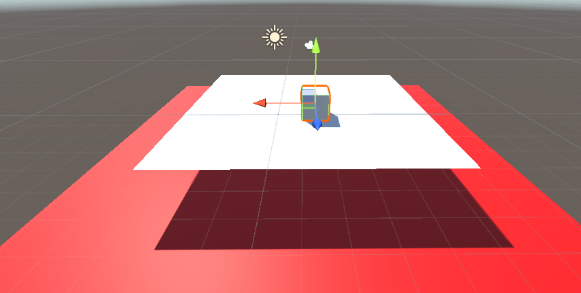
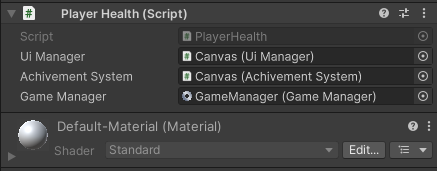
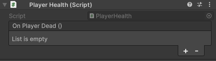
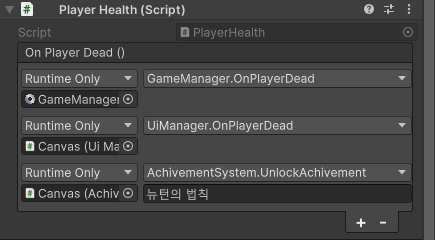

# (Unity) 이벤트
유니티에서 이벤트란 사건 발동이 되면 그 사건에 등록을 해놓은 기능들이 자동으로 발동되는 기능이다. 특이한 것은 이벤트를 발동 시키는 측도 기능을 등록 해놨던 측도 서로에게 관심이 없다.

이벤트에 기능을 등록시키는 측은 기능을 등록해놓고 그게 어떻게 발동되고 언제 발동 시키는지 전혀 신경 안 쓴다.

마찬가지로 이벤트를 발동 시키는 측도 자기 이벤트에 어떤 기능이 등록되어 있는지 신경을 안 쓰고 발동시킨다.
> 만약 이벤트를 사용 안하면?

테스트용 게임으로 큐브를 이동시켜서 빨간색 낭떠러지에 큐브가 떨어지면 UI를 띄우고 게임이 종료되서 게임이 재시작하게 만든다고 가정한다
다음과같은 코드들을 작성하고 테스트한다



* GameManager 오브젝트에 넣은 스크립트
```cs
public class GameManager : MonoBehaviour
{
    //플레이어가 죽고 5초뒤에 시작한다
    public void OnPlayerDead(){
        //어떤 함수를 명시해주고 지연시간을 명시해주면 그 시간만큼 흐른후 함수를 실행한다
        Invoke("Start",5f);
    }
    private void Restart(){
        //지금 보고 있는 씬을 다시 로드 한다
        SceneManager.LoadScene(0);
    }
}
```
* UI Canvas에 넣은 스크립트
```cs
public class AchivementSystem : MonoBehaviour
{
    public Text achivementText;

    //플레이어가 떨어져 죽으면 뉴턴의 법칙이라는 도전과제를 달성하게 해준다
    public void UnlockAchivement(string title){
        Debug.Log("도전과제 해제 - " + title);
        achivementText.text = "도전과제 해제: " + title;
    }
}
```
```cs
public class UiManager : MonoBehaviour
{
    public Text playerStateText;

    //플레이어가 죽었을때 텍스트 내용물을 덮어쓰게한다
    public void OnPlayerDead(){
        playerStateText.text = "You Die";
    }
}
```

직접 작동할 플레이어(큐브) 스크립트중 하나이다
```cs
private void Dead(){
    Debug.Log("사망");
    Destroy(gameObject);
}
void OnTriggerEnter(Collider other) {
    Dead();
}
```

플레이어가 죽었다는 함수를 발동시킬때 자동으로 위에 3가지 기능이 발동되야 한다  
그런데 이벤트가 없으면 스파게티 처럼 엮이게 된다  

밑에 낭떠러지에 떨어지면 `OnTriggerEnter` 함수가 발동되어 `Dead()` 함수를 실행하는데  
원하는 것은 `Dead()`가 실행될때 자동적으로 UIManager에 `OnPlayerDead()`와 AchivementSystem에 `UnlockAchivement()`, 
GameManager에 `OnPlayerDead()` 이 세가지 기능을 동시에 실행시키고 싶다  

그런데 이벤트가 없을 때는 플레이어 스크립트가 UIManager, AchivementSystem, GameManager를 알고있어야 한다.
> 즉 하드하게 엮어 있어야한다(서로가 서로에게 연결되어 있어야 한다)

그렇게되면 코드가 아래와 같이 작성되어야한다.
```cs
public class PlayerHealth : MonoBehaviour
{
    public UiManager uiManager;
    public AchivementSystem achivementSystem;
    public GameManager gameManager;

    private void Dead(){
        uiManager.OnPlayerDead();
        achivementSystem.UnlockAchivement("뉴턴의 법칙");
        gameManager.OnPlayerDead();
        Debug.Log("사망");
        Destroy(gameObject);
    }
    void OnTriggerEnter(Collider other) {
        Dead();
    }
}
```
그리고 Hierarchy창에서 플레이어에 일일이 매니저들을 연동시켜줘야한다  



이벤트가 없는 방식은 `call by reference` 방식을 사용해서 다른 오브젝트들을 일일이 들고와 실행시키게 된다  
이럴때 문제점은 플레이어 죽음에 관여하는 클래스들을 모두 PlayerHealth가 알고있어야해서 복잡하고 결합도가 높아진다

궁극적으로는 플레이어는 플레이어 스스로의 죽음에만 관여를하고 다른 클래스들이 알아서 플레이어가 죽었을때 실행이 되게 하고 싶다  
> 이럴때 이벤트를 사용해야 한다

# 이벤트 사용법

이벤트는 방명록과 비슷한 개념으로 사용이 되는데 Dead 라는 이벤트에 여러 기능들을 명단에 넣어주는데  
정작 플레이어는 Dead 이벤트안에 무슨 기능이 있는지는 관심이 없다는게 핵심이다.  
이벤트안에 기능에 관심을 생기게되면 결국 서로가 연관되게 되어 결합도가 높아지게 되어 이벤트의 의미가 사라진다.  

그래서 이벤트를 사용하면 이벤트가 실행될때 명단에 등록된 기능들이 자동으로 실행하게 할 수 있는데 추가로 다른 기능을 넣으려고하면  
그 명단에 자기 자신을 등록만 하면되지 플레이어가 그 클래스까지 알아야 할 필요가 없어지게 된다

아래코드처럼 `UnityEvent` 키워드를 사용하여 이벤트를 생성하여 `.Invoke()` 함수로 이벤트를 발생시킨다
```cs
using UnityEngine.Events;//이 네임스페이스를 사용해야 이벤트를 사용할 수 있다
public class PlayerHealth : MonoBehaviour
{
    //기능들이 바깥에서 등록할 수 있는 명단
    public UnityEvent onPlayerDead;
    private void Dead(){
        onPlayerDead.Invoke();
        Debug.Log("사망");
        Destroy(gameObject);
    }
    void OnTriggerEnter(Collider other) {
        Dead();
    }
}
```
스크립트를 작성후 Hierarchy에서 플레이어 Inspector를 보면 OnPlayerDead 라는 리스트가 추가된걸 볼 수 있는데 유니티 이벤트이다.



이 이벤트는 함수를 등록할 수 있는 명단으로서 + 버튼을 눌러 OnPlayerDead가 발동이 되었을때 연쇄적으로 같이 실행될 기능을 추가할 수 있다.
발동시킬 기능을 가지고 있는 오브젝트를 등록하고 그 기능들을 펼쳐서 등록하고싶은 기능을 고르면 된다.



> 결국 이벤트로 코드를 깔끔하게 작성할 수 있고 오브젝트들이 하드하게 연결되어있지 않아 확장성이 매우 좋아진다.
